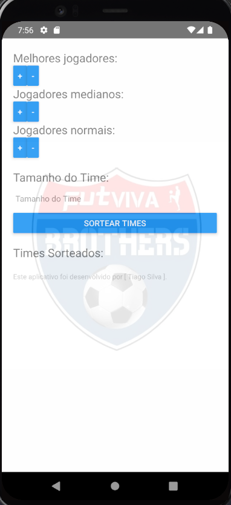
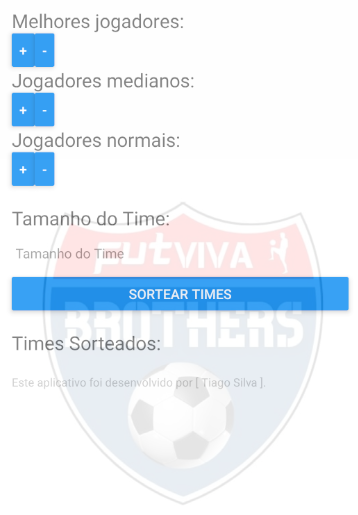
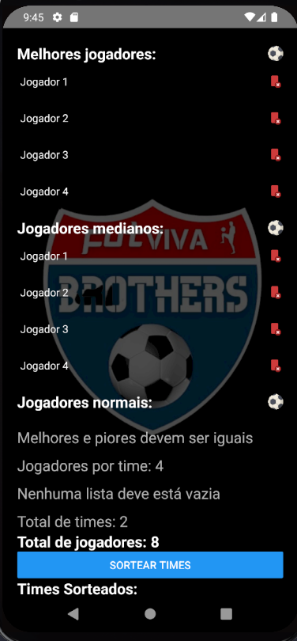
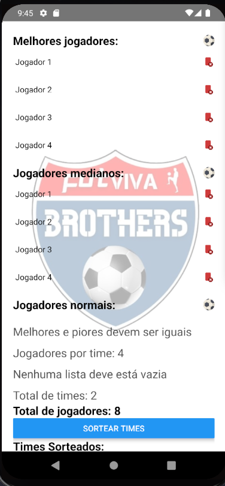

# Aplicativo para sorteio de times
Aplicativo simples para sorteio de times feito com React e Typescript.


<h1 align="center">
    
    
    
    
</h1>


## 💻 Requisitos

Antes de iniciar, você deve ter o Node.js e o NPM instalados em sua máquina.

## 🚀 Instalando

Primeiro, você deve clonar o projeto na sua máquina, para isso você
pode colar o seguinte comando em seu terminal

```bash
git clone https://github.com/Tiago-Silva/SortTeams.git
```
Para instalar as dependências, execute o seguinte comando:

```bash
npm install
```
ou

```bash
yarn install
```

Por fim, para executar o projeto basta rodar o seguinte:

```bash
yarn start
```

## 📝 Licença

Este projeto está licenciado sob a licença MIT. Consulte o arquivo `LICENSE` para obter mais informações.
